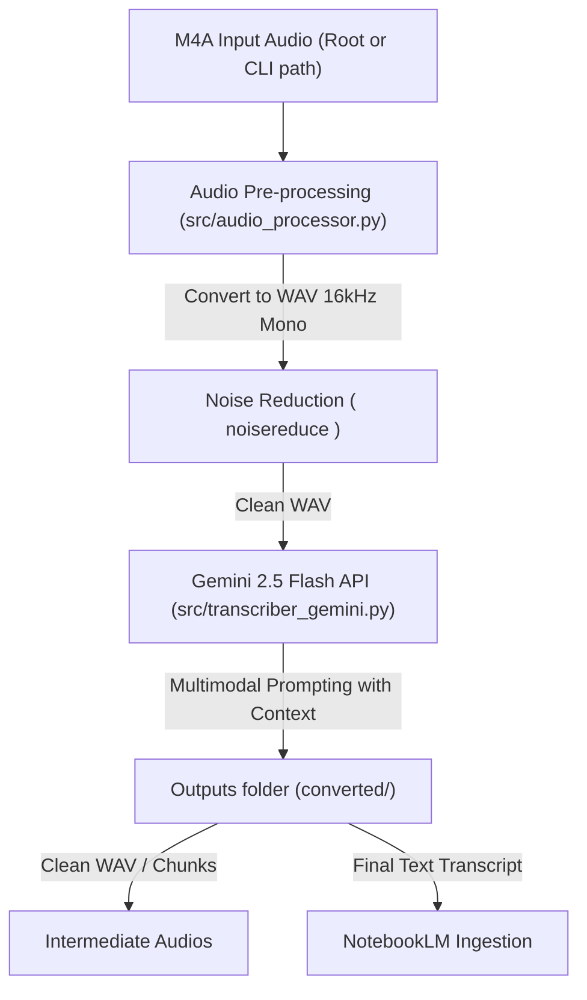

# Infrastructure and Architecture: ScribePy

This document outlines the architecture, pipeline stages, token optimization strategies, and the structural design of the ScribePy transcription tool.

## Technical Architecture

The ScribePy architecture is designed under the Python package conventions (PEP 8/PEP 518) using a `src/` package layout. The pipeline isolates generated output and intermediate assets inside the `converted/` directory, mitigating any deletion risks on code and configuration assets.



### Directory Structure & Organization

```text
ScribePy/
├── .env                       # API Credentials and Model Configurations
├── main.py                    # CLI Wrapper entry point (orchestrates execution parameters)
├── infrastructure.md          # Architectural Blueprint (this file)
├── converted/                 # Isolated output workspace (transcripts, corrections, clean WAVs)
├── src/                       # Main Python Package containing the business logic
│   ├── __init__.py            # Registers src/ as a package
│   ├── audio_processor.py     # Local audio manipulation (resampling, noise reduce, slicing)
│   ├── transcriber_gemini.py  # Gemini API service client wrapper
│   ├── pipeline.py            # Programmatic smart resume & slice execution pipeline
│   ├── spinner.py             # Multithreaded console spinner & elapsed time counter
│   └── cleaner.py             # File system cleanup helper interface
└── scripts/                   # Utility automation scripts
    ├── cleanup.py             # Manual run script to delete files in converted/
    ├── fix_by_time.py         # Surgical segment correction script
    └── fix_ranges.txt         # Targets for segment corrections
```

---

## Technical Flow & Components

### 1. Programmatic Pipeline (`src/pipeline.py`)
* The core process is fully decoupled from command line interfaces and terminal exits. It raises Python-native exceptions (`FileNotFoundError`, `RuntimeError`) to allow future integration with backend endpoints (like FastAPI) or GUI frameworks.
* **Checkpoint & Smart Resume**: Inspects the target file inside the `converted/` directory. If incomplete, it computes the exact timestamp and slices the intermediate WAV file, resuming the transcription process using Gemini API without duplicating previous costs.

### 2. Output Isolation (`converted/` directory)
* To protect source code scripts and `.env` credentials, all output and intermediate files generated during executions are restricted to the `converted/` directory:
  * `{audio_name}_clean.wav` (pre-processed master audio file)
  * `{audio_name}_resume.wav` (temporary fragment for resuming)
  * `{audio_name}_transcript.txt` (final formatted output)
  * `{audio_name}_transcript_correcoes.txt` (surgical corrected output chunks)
  * `temp_slice_*.wav` (surgical audio segment slices)

### 3. Asynchronous UX Monitoring (`src/spinner.py`)
* Consists of a multithreaded CLI indicator (`TerminalSpinner`) executing on a background thread during blocking API calls (e.g. `client.models.generate_content`).
* Provides live processing indicators (`... / 00:03`, `... / 00:04`) to monitor Gemini request states, ensuring the user gets real-time execution response status instead of an apparently frozen console.

### 4. Deletion Isolation Policy (`src/cleaner.py` and `scripts/cleanup.py`)
* Automatic deletion of intermediate WAV files is commented out by default to let the user review the files.
* A manual execution script (`scripts/cleanup.py`) can be called by the user. It scans only inside the `converted/` directory and prompts the user with confirmation before erasing files.

---

## Token Optimization & Cost Strategies

### 1. Resampling Optimization
* Downsamples input files to **16kHz, Mono, 16-bit PCM** before uploading.
* Minimizes file payload size, speeding up network transit to Gemini File API.

### 2. Audio Token Count
* Gemini 1.5 and 2.5 tokenization is based on audio duration: **1 second of audio ≈ 266 tokens**.
* Resuming from the correct checkpoint avoids duplicate prompting of the entire file, significantly lowering developer costs on long-running audio files.
