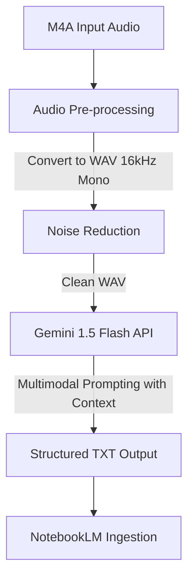

# Infrastructure and Architecture: ScribePy

This document outlines the architecture, pipeline stages, and token optimization strategies for the ScribePy transcription tool.

## Technical Architecture

The transcription pipeline follows a three-stage layout:

### 1. Audio Pre-processing Stage (Local)
* **Library**: `pydub` (requires system `ffmpeg`).
* **Conversion**: Converts input `.m4a` files into `.wav`.
* **Resampling**: Downsamples the audio to **16kHz, Mono, 16-bit PCM**. This is the standard audio format for most speech recognition and LLM models. It significantly reduces file size (improving upload speeds) while preserving critical voice frequencies.
* **Noise Cleaning**: Uses `noisereduce` to apply spectral gating and clean constant factory noise (such as exhaust fans, engine hums, and ovens).
* **Gain Normalization**: Normalizes audio volume to amplify speech signals without clipping.

### 2. Transcription & Diarization Stage (Cloud)
* **Model**: `gemini-1.5-flash` via the official `google-genai` Python library.
* **Multimodal Capability**: Gemini 1.5 natively accepts raw audio files in the API request payload.
* **In-Context Guidance**: The API request includes a system instruction prompt detailing:
  * The industrial context (aluminum sublimation factory).
  * A technical glossary to correct homophones and niche terms (e.g., ensuring "filme sublimático" is transcribed instead of "filme de cinema").
  * Rules for speaker diarization (e.g., detecting and separating conversations into `Participant 1`, `Participant 2`, etc.).
  * Formatting instructions for timestamps (`[MM:SS]`).

---

## Token Optimization & Cost Strategies

Although the Gemini API free tier allows up to 15 requests per minute, optimizing token consumption is crucial for scalability and avoiding rate limits.

### 1. Audio Duration as Tokens
* For Gemini 1.5, audio is tokenized based on duration rather than raw file size.
* **Rate**: 1 second of audio is roughly equivalent to **266 tokens**.
  * A 10-minute audio file uses ~160,000 tokens.
  * A 30-minute audio file uses ~480,000 tokens.
* **Optimization**: Since duration dictates the token cost, we do not need to split audio files purely to save tokens, but converting them to a clean format ensures the model can process them in a single prompt call without hallucinating or losing context.

### 2. System Instruction Optimization
* Keep the technical glossary concise. Only include words that the model is likely to mistake based on acoustic similarity (e.g., "filme sublimático", "extrusão", "perfil de alumínio").
* Avoid conversational filler in the system prompt to minimize input prompt tokens.

### 3. NotebookLM Workflow Integration
* The final output is formatted as a lightweight, clean `.txt` or `.md` transcript.
* By uploading the structured text file to NotebookLM alongside a static factory glossary document, we minimize the token load on NotebookLM, ensuring high-speed context search and synthesis.
